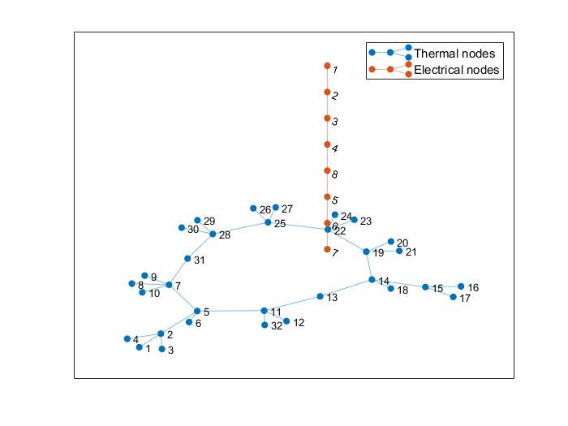
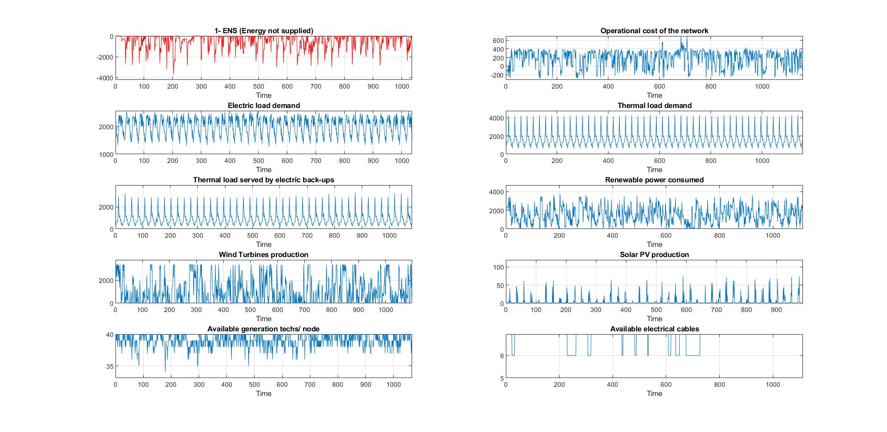

# **Simulation Code for Combined Heat and Electric Networks**  

This repository contains MATLAB code for simulating various operational states of a combined heat and electricity network, integrating distributed generators and heat pumps.  

## **📄 Citation**  
If you use this code, please cite the following:  

```bibtex
@INPROCEEDINGS{8272792,
  author={Rocchetta, Roberto and Patelli, Edoardo},
  booktitle={2017 2nd International Conference on System Reliability and Safety (ICSRS)}, 
  title={Stochastic analysis and reliability-cost optimization of distributed generators and air source heat pumps}, 
  year={2017},
  pages={31-35},
  doi={10.1109/ICSRS.2017.8272792}
}
```
  

## ⚙️ Functionality

### Core Functions
- **`MC_HP.m`** → Power production model for multi-compressor air-to-water heat pumps  
- **`OnOff_HP.m`** → Power model for an on-off air-to-water heat pump (Maneurop SH 140-4)  
- **`HPP.m`** → Samples from a homogeneous Poisson Process (HPP)  
- **`MarkovFailure.m`** → Simulates random failures of network components  
- **`MC_HEATPOWER(X, D)`** → Monte Carlo simulation of the combined network  
  - `X`: Allocation matrix  
  - `D`: Data structure containing grid information  
- **`DG_module.m`** → Simulates power production from distributed generators (PV, EV, ST, WT, HP)  
- **`Weather_Simulator.m`** → Simulates weather conditions based on geo-location and day of the year  
- **`PowEl2PowTh.m`** → Converts electrical power to thermal power  
- **`OPF.m`** → Optimal power flow function considering virtual generators  
- **`Clear_Sky_IT.m`** → Computes clear sky irradiance  

### Data Structures
- **`D.mat`** → Contains key grid data:
  - **`Del`** → Electrical grid data  
  - **`Dth`** → Thermal grid data  
  - **`Weather`** → Weather data for simulations  

---

## 📌 Examples

### Example 1: Monte Carlo Simulation for Resilience Assessment  
This example evaluates reliability and resilience (energy not supplied distribution) using Monte Carlo simulations for a given allocation matrix.

```matlab
Temp=load('D.mat'); % load data
D = Temp.D; # all data in the structure D
Del= Temp.D.Del; % electrical grid data
Dth= Temp.D.Dth; % thermal grid data
Wtr= Temp.D.Weather; % weather data
```

 
```matlab
 %% show topology of the two networks (not linked and separatelly)
figure(10)
G_th=graph(D.Dth.From_Node,D.Dth.To_Node);
G_th.plot;
hold on; grid on
G_el=graph(D.Del.FDks,D.Del.FDke);
G_el.plot
legend('Thermal nodes', 'Electrical nodes')
```   

<p align="center">
  
</p>


 
```matlab
% Electrical allocation matrix (MS, PV, WT, EV, ST)
# MainSources PhotoV  WindT  ElVehicle StorageUnits
x_el = [0,11, 0,0,13;  % Node 1
        1, 0,11,0, 1;  % Node 2
        0,11,23,0,10;  % Node 3
        0, 0,11,0,21;  % Node 4
        0,11, 0,0,11;  % Node 5
        0, 0, 0,0, 2;  % Node 6
        1,11,11,0, 0;  % Node 7
        1,11,11,0,11]; % Node 8

# Aggregated Number of HeatPumps at the electrical nodes
x_th = [5;  % Node 1
        0;  % Node 2
        0;  % Node 3
        0;  % Node 4
        0;  % Node 5
       14;  % Node 6
        0;  % Node 7
        0]; % Node 8    

X_candidate = [x_el, x_th];
```    


```matlab
% Run Monte Carlo simulation for data structure D and thermal-electrical allocation 

[RES] = MC_HEATPOWER(X_candidate, D);  
```   


<p align="center">
  
</p>

 
